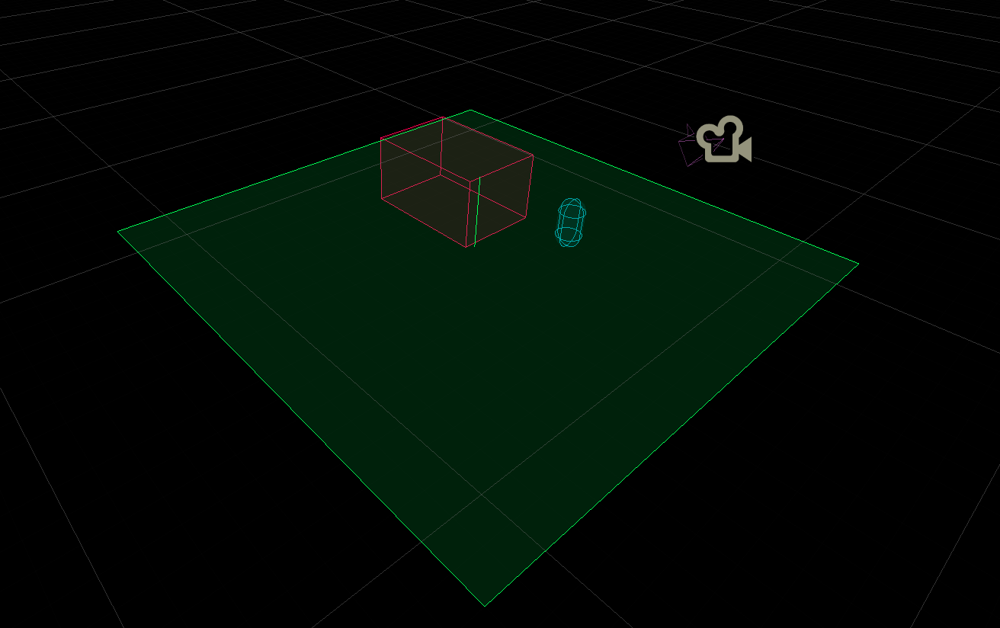
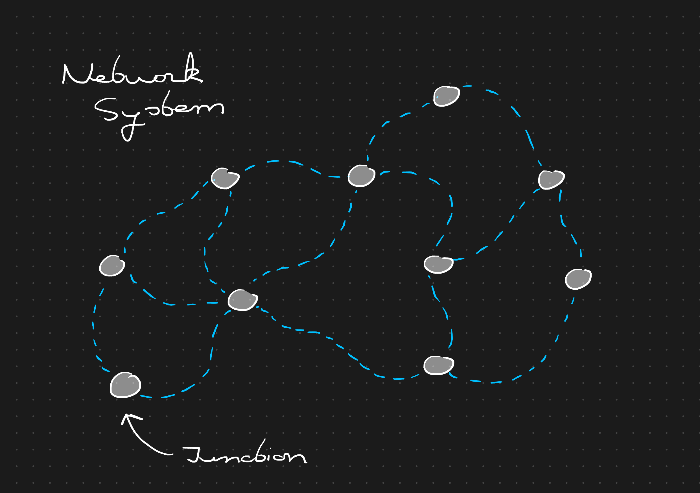

# Blind Nature

An audio-only adventure game set in nature. The core of the game lies in exploration, which leads to story elements or encounters. Part of the game is to learn how to navigate and orientate without sight. To this end, we have a navigational bird, sound cues and vibration cues.

The name *Blind Nature* refers to experiencing nature as a blind person, but also to the natural blindness of the protagonist Liora, i.e "It is in her nature to be blind".

## Contents

- [Blind Nature](#blind-nature)
	- [Contents](#contents)
	- [Story](#story)
		- [A Blind World](#a-blind-world)
		- [Threats To The Forest](#threats-to-the-forest)
		- [To Heal A Wound](#to-heal-a-wound)
	- [Gameplay](#gameplay)
		- [World Setup](#world-setup)
		- [The Forest Network](#the-forest-network)
		- [Orientation](#orientation)

## Story

### A Blind World

Liora is a young woman aged (20-30) that wakes up in a forest hut. She has never been here before, and does not remember anything of her past, except that she is blind. Inside the hut is her bed, some pots for cooking, and a bow-and-arrow with a quiver full of arrows.

As Liora steps outside, she struggles walk due to her blindness. In the distance she can hear a screech of a *Kestrel* (a small falcon-like predatory bird). Kestrels lands a few feet in front of her and repeats chirping sounds. Liora, surprised by the noises of a bird, follows the sound and approaches Kestrel. As the sound gets stronger, Kestrel flies a few meters further to a different spot. In this way, Liora learns of the existence of a path that Kestrel is guiding her through.

Liora grows accustomed to the forest through the help of Kestrel. While she can't see, Kestrel can. When Kestrel spots an interesting area in the forest, he will alert Liora and guide her there. She also learned to aim with her bow with the assistance of Kestrel. When Liora is aiming on target, Kestrel makes a slight noise. 

### Threats To The Forest

On one day, while Liora is exploring the forest with Kestrel, she finds a recorder with a single tape on the inside. This tape describes the forest through the eyes of an adventurer that came her long before. "Birds with shimmering blue hues on their feathers. Flowers in any color imaginable". The adventurer goes on explaining how each flower smells different, which birds make which sounds, and the other living animals in the forest. For Liora, these descriptions add much "color" to her imagination of the world around her.

Later, Kestrel comes to Liora with a concerning message: A sick tree. As Liora makes her way to the place, a putrid scent from the tree becomes very evident. The tree is rotting, but the cause seems to be unknown. Using a combination of special herbs, she creates a mixture and uses it to treat the tree.

In the night, Liora is woken by Kestrel due to a strange "creature" wandering in the forest. This creature is a formless spirit. A cloud of smoke that can assume any form it wants. Regular spirits are not engulfed in a cloud of smoke. The same stench comes from the smoke as the rotten tree from before. Liora prepares her arrow with the same medicinal mixture and fires loose at the formless spirit. The spirit lets out a screech and evaporates back into the sky.

### To Heal A Wound

After the events with the formless spirit, Liora sets out to understand the anger of the spirits. 

## Gameplay

### World Setup

The entire game world is a 3D scene **without visuals**. There are trees, bushes, ponds and rivers, aswell as several species of animals and birds. Most objects are either simple 3D points in space that can emit audio, or have a collider that is used in navigation. The world is edited as any other game scene. The debug visuals show where objects are located.

### The Forest Network

Because navigating an arbitrary forest without guidance is hard (even as a sighted person!), the entire world map is covered by a network of junctions and paths. A junction *can* be a key location in the map. The area around a junction should be as unique as possible to aid in orientation (more details in [Orientation](#orientation)).

The paths between junctions do not have to be as recognizable as the junctions themselves, but some small details can be added. The whole essence of the network is to provide **known routes to fall back on** during exploration.

### Orientation