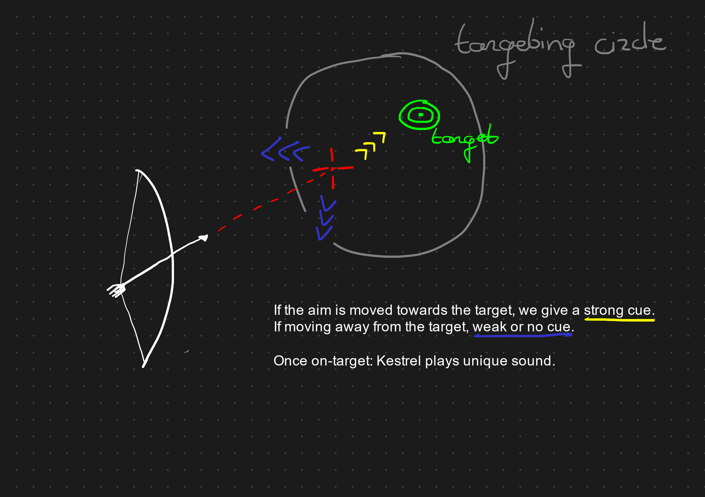

# Blind Nature

An audio-only adventure game set in nature. The core of the game lies in exploration, which leads to story elements or encounters. Part of the game is to learn how to navigate and orientate without sight. To this end, we have a navigational bird, sound cues and vibration cues.

The name *Blind Nature* refers to experiencing nature as a blind person, but also to the natural blindness of the protagonist Liora, i.e "It is in her nature to be blind".

## Contents

- [Blind Nature](#blind-nature)
	- [Contents](#contents)
	- [Story](#story)
		- [A Blind World](#a-blind-world)
		- [Threats To The Forest](#threats-to-the-forest)
		- [To Heal A Wound](#to-heal-a-wound)
	- [Gameplay](#gameplay)
		- [World Setup](#world-setup)
		- [The Forest Network](#the-forest-network)
		- [Orientation](#orientation)
		- [Eye Of The Forest: Kestrel](#eye-of-the-forest-kestrel)
		- [Echo-Location Focus System](#echo-location-focus-system)
		- [Aim-Feedback System](#aim-feedback-system)
	- [Demo 1](#demo-1)

## Story

### A Blind World

Liora is a young woman aged (20-30) that wakes up in a forest hut. She has never been here before, and she does not remember anything of her past, except that she is blind. Inside the hut is a bed, some pots for cooking, and a bow-and-arrow with a quiver full of arrows.

As Liora steps outside, she struggles to walk due to her blindness. In the distance she can hear a screech of a *Kestrel* (a small falcon-like predatory bird). This bird she calls Kestrel. Kestrel lands a few feet in front of her and starts making chirping sounds. Liora, surprised by the noises of the bird, moves towards the sound and approaches Kestrel. As the sound gets stronger, Kestrel flies a few meters further to a different spot. In this way, Liora learns of the existence of a path that Kestrel is guiding her through.

Liora grows accustomed to the forest through the help of Kestrel. While she can't see, Kestrel can. When Kestrel spots an interesting area in the forest, he will alert Liora and guide her there. She also learned to aim with her bow with the assistance of Kestrel. When Liora is aiming on target, Kestrel makes a slight noise. 

### Threats To The Forest

One day while Liora is exploring the forest with Kestrel, she finds a recorder with a single tape on the inside. This tape describes the forest through the eyes of an adventurer that came here long before. "Birds with shimmering blue hues on their feathers. Flowers in any color imaginable". The adventurer goes on explaining how each flower smells different, which birds make which sounds, and which other animals live in the forest. For Liora, these descriptions strengthen her imagination of the world around her.

Later, Kestrel comes to Liora with a concerning message: A sick tree. As Liora makes her way to the place, a putrid scent from the tree becomes very evident. The tree is rotting, but the cause seems to be unknown. Using a combination of special herbs, she creates a mixture and uses it to heal the tree.

In that same night, Liora is woken by Kestrel due to a strange "creature" wandering in the forest. This creature is a formless spirit. A cloud of smoke that can assume any form it wants. Regular spirits are not engulfed in a cloud of smoke. The same stench comes from this formless spirit as from the rotten tree of before. Liora prepares her arrow with the same medicinal mixture and fires loose at the spirit. The spirit lets out a screech and evaporates back into the sky.

### To Heal A Wound

After the events with the formless spirit, Liora sets out to understand the anger of the spirits. W.I.P 

## Gameplay

### World Setup

The entire game world is a 3D scene **without visuals**. There are trees, bushes, ponds and rivers, aswell as several species of animals and birds. Most objects are either simple 3D points in space that can emit audio, or have a collider that is used in navigation. The world is edited as any other game scene. The debug visuals show where objects are located.

### The Forest Network

Because navigating an arbitrary forest without guidance is hard (even as a sighted person!), the entire world map is covered by a network of junctions and paths. A key location in the map should have a nearby junction. The area around a junction should be as unique as possible to aid in orientation (more details in [Orientation](#orientation)).

The paths between junctions do not have to be as recognizable as the junctions themselves, but some small details can be added. The whole essence of the network is to provide **known routes to fall back on** during exploration.

Kestrel will always navigate the player across this network to reach other locations. If Liora is not on a path already, then Kestrel will first guide Liora to the nearest path and continue from there.

### Orientation

The problem of orientation is to give the player an idea of where they are in the game world. This requires that players can at the very least identify unique details of their current environment. Below I enumerate some ways to strengthen orientation.

1. *Distinct soundscape*
	* Nearby streams or waterfalls.
	* Unique species of birds living specifically in this area.
	* Sound when walking over the ground (grass, dirt, rock).

2. *Player-made guidance cues*
	
	We can let the player craft sound emitters from natural materials like wood bells, ticking sounds, rustling sounds, whistles etc. If the player has trouble identifying a location, they can choose to permanently place down one of these guidance cues. This can also be done with vibration-based cues like a tremor-generating machine.

	I particularly like this idea because it gives control back to the player to make their orientation more efficient. It can be very satisfying to successfully navigate with cues placed by yourself! Having too many cues is no longer benefical, and we can also choose to destroy cues under certain conditions.

3. *Liora narrating what she feels and smells*

	For some areas, it can be helpful to verbally narrate senses that we can not communicate through the gameplay itself. If the area feels cold, we can have her say that. If the smell of a rotting tree is present, she can mention that too. This can add the extra detail and personality to certain areas.

4. *Touching system*

	To pair with point (3), we can implement a system where Liora instinctively touches nearby objects and describes how they feel. This can be complemented with a vibration cue when there is contact. This way we can communicate tree, rocks, monuments and other silent-standing objects.

	For example, if the player detects a statue using the [Echo-location focus system](#echo-location-focus-system), they can have it described by Liora who could say "It is in the shape of a man wielding a trident". That would be key information to pinpoint the location.

### Eye Of The Forest: Kestrel

Kestrel is the companion bird of Liora. In this game, it functions as a quest-giver when it spots anything unusual in the forest. Through Kestrel, we can lead Liora to key locations in the game and make events happen there. Kestrel will guide Liora along the paths using the [Forest Network](#the-forest-network) mentioned earlier. Besides acting like a navigator, we can add some other features and subtle interactions here.

- Having Kestrel assist while aiming with a bow, giving sound feedback together with the vibrations when going in the right direction.
- Ask Kestrel to search the nearby area for certain herbs or resources.
- Ask Kestrel to fetch something by itself.
- Ask Kestrel to navigate to a previously visited junction.
- Pet and feed Kestrel.

### Echo-Location Focus System

W.I.P: A system for short-term sensing of objects by making silent objects emit distinct sound cues while silencing all other sounds in a focus-mode. This is not part of the demo.

### Aim-Feedback System

This game expands upon [the demo I created on vibration-based aiming](https://arceryz.itch.io/blind-aiming). The key idea is to give a strong cue (vibration/audio) when the player is shifting their aim *towards* the target, and to gradually give a weaker cue if they go the wrong direction. The above demo used only vibration for directional cues, but combining vibration with audio gives a stronger effect. Kestrel will play a distinct sound when the aim is on-target. This is when the arrow can be released.

## Demo 1

For the first demo, we want to test:

1. The navigation system with Kestrel.
2. The aiming system with vibration and Kestrel.
3. How oriented we are when trying to understand where we are.

Therefore we set up the world as follows: Liora wakes up and leaves the hut. She tells Kestrel that she wants to practice archery. Kestrel will guide her to three archery targets throughout the map. When Liora is the right distance away from the target, Kestrel will give a sound cue.

Once Liora hit the target, Kestrel continues. Once all three targets are hit, Kestrel will chill in a nearby tree and Liora can explore on her own. Then, by calling Kestrel, Liora can ask him to guide her back towards the hut. The demo is now complete.